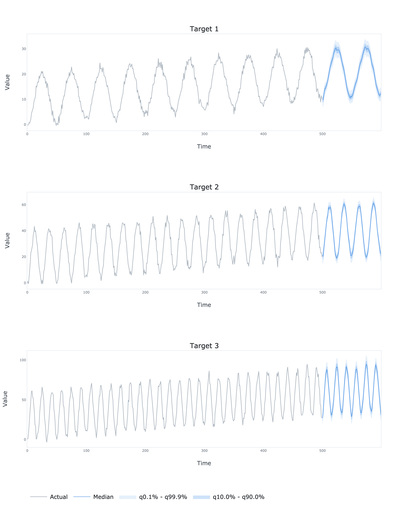

# TCAN TensorFlow


TensorFlow implementation of multivariate time series forecasting model introduced in Lin, Y., Koprinska, I., 
and Rana, M. (2021). Temporal Convolutional Attention Neural Networks for Time Series Forecasting. In *2021 International
Joint Conference on Neural Networks (IJCNN)* (pp. 1-8). IEEE.


*Model architecture (source: [doi: 10.1109/IJCNN52387.2021.9534351](https://doi.org/10.1109/IJCNN52387.2021.9534351))*

## Dependencies
```bash
pandas==1.5.2
numpy==1.23.5
tensorflow==2.11.0
tensorflow_probability==0.19.0
tensorflow_addons==0.19.0
plotly==5.11.0
kaleido==0.2.1
```
## Usage
```python
import numpy as np

from tcan_tensorflow.model import TCAN
from tcan_tensorflow.plots import plot

# Generate some time series
N = 500
t = np.linspace(0, 1, N)
e = np.random.multivariate_normal(mean=np.zeros(3), cov=np.eye(3), size=N)
a = 10 + 10 * t + 10 * np.cos(2 * np.pi * (10 * t - 0.5)) + 1 * e[:, 0]
b = 20 + 20 * t + 20 * np.cos(2 * np.pi * (20 * t - 0.5)) + 2 * e[:, 1]
c = 30 + 30 * t + 30 * np.cos(2 * np.pi * (30 * t - 0.5)) + 3 * e[:, 2]
y = np.hstack([a.reshape(-1, 1), b.reshape(-1, 1), c.reshape(-1, 1)])

# Fit the model
model = TCAN(
    y=y,
    x=None,
    forecast_period=100,
    lookback_period=100,
    quantiles=[0.001, 0.1, 0.5, 0.9, 0.999],
    filters=32,
    kernel_size=7,
    dilation_rates=[1, 2, 4],
    dropout=0,
    alpha=1.5
)

model.fit(
    regularization=0.5,
    learning_rate=0.001,
    batch_size=32,
    epochs=200,
    verbose=1
)

# Generate the forecasts
df = model.forecast(y=y, x=None)

# Plot the forecasts
fig = plot(df=df, quantiles=[0.001, 0.1, 0.5, 0.9, 0.999])
fig.write_image('results.png', scale=4, height=900, width=700)
```

