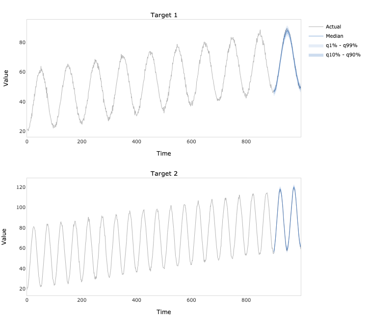
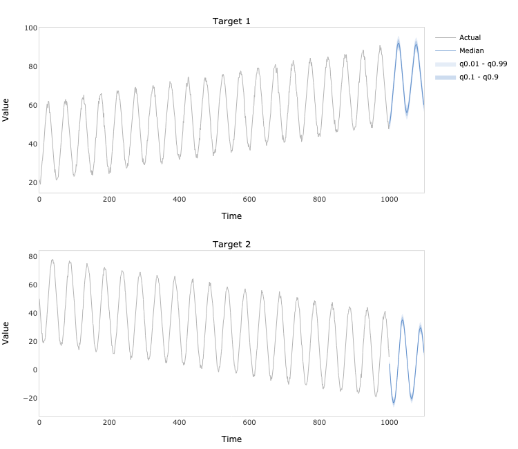

# TCAN TensorFlow


TensorFlow implementation of multivariate time series forecasting model introduced in Lin, Y., Koprinska, I., 
and Rana, M. (2021). Temporal Convolutional Attention Neural Networks for Time Series Forecasting. In *2021 International
Joint Conference on Neural Networks (IJCNN)* (pp. 1-8). IEEE. 
[doi:10.1109/IJCNN52387.2021.9534351](https://doi.org/10.1109/IJCNN52387.2021.9534351).

## Dependencies
```bash
pandas==1.5.1
numpy==1.23.3
tensorflow==2.9.1
tensorflow_probability==0.17.0
tensorflow_addons==0.17.1
plotly==5.10.0
kaleido==0.2.1
```
## Usage
```python
import numpy as np
from tcan_tensorflow.model import TCAN

# Generate two time series
N = 1000
t = np.linspace(0, 1, N)
e = np.random.multivariate_normal(mean=np.zeros(2), cov=np.eye(2), size=N)
a = 40 + 30 * t + 20 * np.cos(2 * np.pi * (10 * t - 0.5)) + e[:, 0]
b = 50 + 40 * t + 30 * np.cos(2 * np.pi * (20 * t - 0.5)) + e[:, 1]
y = np.hstack([a.reshape(- 1, 1), b.reshape(- 1, 1)])

# Fit the model
model = TCAN(
    y=y,
    x=None,
    forecast_period=100,
    lookback_period=200,
    quantiles=[0.01, 0.1, 0.5, 0.9, 0.99],
    filters=32,
    kernel_size=7,
    dilation_rates=[1, 2, 4],
    dropout=0,
    alpha=1.5
)

model.fit(
    regularization=0.5,
    learning_rate=0.001,
    batch_size=32,
    epochs=200,
    verbose=1
)
```
```python
# Plot the in-sample predictions
predictions = model.predict(index=900)
fig = model.plot_predictions()
fig.write_image('predictions.png', width=750, height=650)
```

```python
# Plot the out-of-sample forecasts
forecasts = model.forecast()
fig = model.plot_forecasts()
fig.write_image('forecasts.png', width=750, height=650)
```

